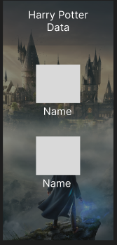
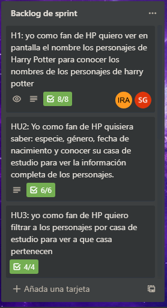
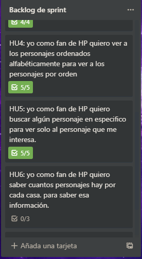
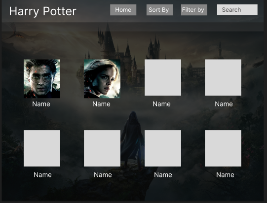
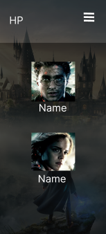
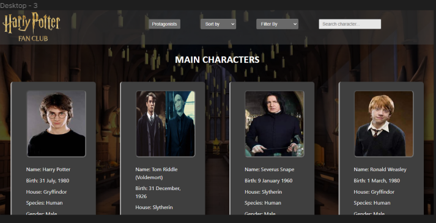
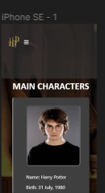
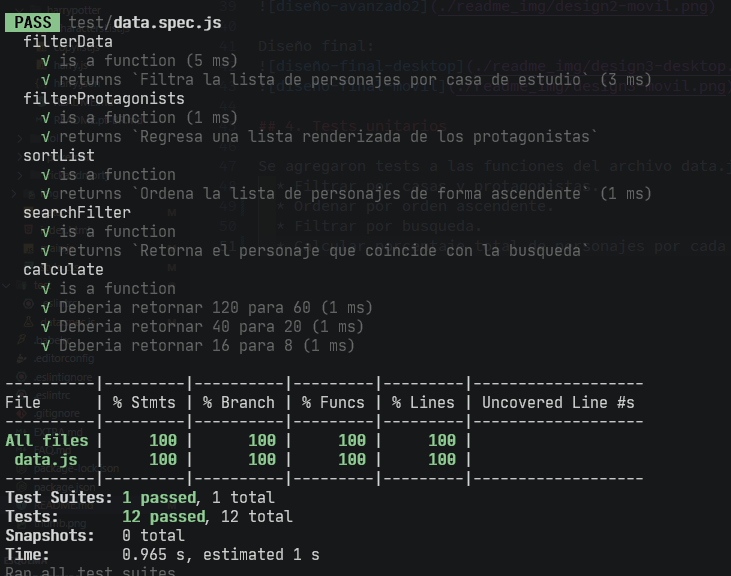

# Data Lovers

## Índice

* [1. Preámbulo](#1-preámbulo)
* [2. Historias de usuarios](#2-historias-de-usuarios)
* [3. Diseños de Alta fidelidad](#3-diseños-de-alta-fidelidad)
* [4. Tests Unitarios](#4-tests-unitarios)

***

## 1. Preámbulo

Este proyecto tiene el proposito de mostrar a las fanaticas de Harry potter más información sobre los personajes
que tanto les gustan. 

Haciendo una investigación sobre la información que podrían necesitar nuestras usuarias encontramos que los datos de mayor interés son:

Información sobre los personajes como nombre, especie, género, fecha de nacimiento y conocer su casa de estudio.

Se planeo realizar un diseño pensando en lo que le gustaría ver a los fans y en base a ello proporcinar una interfaz agradable a la vista pero a la vez facil de utilizar.  

Estos fueron los protipos de diseño base:

## 2. Historias de usuarios

Para las historias de usuarios se utilizo Trello como metodo de organización, cada sprint se planeaba una nueva historia de usuario en base a lo que se acordaba avanzar. En total se crearón 6 historias de usuario en toda la realización del proyecto.

## 3. Diseños de Alta fidelidad
Estos fueron los diseños que se planearon cuando ya se tenia una mayor avance del proyecto:

Diseño final:

## 4. Tests unitarios

Se agregaron tests a las funciones del archivo data.js las cuales fueron:
  * Filtrar por casas y protagonistas.
  * Ordenar por orden ascendente.
  * Filtrar por busqueda.
  * Calcular porcentaje total de personajes por cada casa.

Problemas al ejecutar tests:
 - Detecto problemas de identación.
 - En la función calculate: esperaba recibir un string y recibia un numero entero.

Feedbacks:
 - Nos sugirieron cambiar el titulo.
 - El tamaño de la letra era muy pequeño
 - Se veía muy obscuro